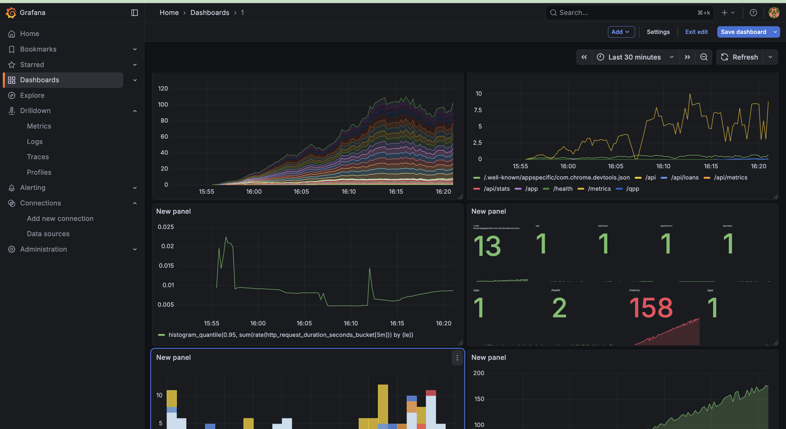

# Flask Microloans API + Postgres (Docker)

Branch Loans API is a containerized Flask application providing loan management, health monitoring, and Prometheus-based observability.

It supports three isolated environments:

- Development → Hot reload, debug logging, lightweight DB
- Staging → Production-like environment with resource limits
- Production → Optimized API, JSON logs, health checks, persistent DB storage

It uses:

- Docker Compose for environment management
- GitHub Actions (CI/CD) for automated builds, tests, security scans, and deployments
- Prometheus + Grafana for monitoring and dashboards

# Flask Microloans API + Postgres (Docker)

Minimal REST API for microloans, built with Flask, SQLAlchemy, Alembic, and PostgreSQL (via Docker Compose).

## Quick start

```bash
# 1) Build and start services
docker compose up -d --build

# 2) Run DB migrations
docker compose exec api alembic upgrade head

# 3) Seed dummy data (idempotent)
docker compose exec api python scripts/seed.py

# 4) Hit endpoints
curl http://localhost:8000/health
curl http://localhost:8000/api/loans
```

## Configuration

See `.env.example` for env vars. By default:

- `DATABASE_URL=postgresql+psycopg2://postgres:postgres@db:5432/microloans`
- API listens on `localhost:8000`.

## API

- GET `/health` → `{ "status": "ok" }`
- GET `/api/loans` → list all loans
- GET `/api/loans/:id` → get loan by id
- POST `/api/loans` → create loan (status defaults to `pending`)
- GET `/api/stats` → aggregate stats: totals, avg, grouped by status/currency.

## Development

- App entrypoint: `wsgi.py` (`wsgi:app`)
- Flask app factory: `app/__init__.py`
- Models: `app/models.py`
- Migrations: `alembic/`

## How to Run the Application Locally

1️⃣ Clone Repository

```bash
git clone <your-repo-url>
cd dummy-branch-app
```

2️⃣ Choose an Environment

Your repo includes:

- `.env.dev`
- `.env.staging`
- `.env.prod`

All environment files are ignored in Git for security.

3️⃣ Run Development Environment

Development mode includes hot reload + debug logging.

```bash
docker compose --env-file .env.dev \
  -f docker-compose.yml \
  -f docker-compose.dev.yml up --build
```

4️⃣ Run Staging Environment

Mimics production with CPU/memory limits & structured logging.

```bash
docker compose --env-file .env.staging \
  -f docker-compose.yml \
  -f docker-compose.staging.yml up --build
```

5️⃣ Run Production

Persistent DB volumes, optimized gunicorn workers, JSON logs.

```bash
docker compose --env-file .env.prod \
  -f docker-compose.yml \
  -f docker-compose.prod.yml up -d --build
```

## Nginx reverse proxy & SSL

This project includes an Nginx config at `nginx/nginx.conf` and mounts the `nginx/ssl` directory into the container. To enable TLS locally you can generate a self-signed certificate and add a local DNS mapping.

1. Generate a self-signed certificate (script included)

```bash
# make script executable once
chmod +x scripts/generate_selfsigned_cert.sh
./scripts/generate_selfsigned_cert.sh
```

This creates `nginx/ssl/branchloans.com.key` and `nginx/ssl/branchloans.com.crt` (backing up any existing files).

2. Add a local DNS entry (edit `/etc/hosts`)

Run as root (example):

```bash
sudo -- sh -c "echo '127.0.0.1 branchloans.com' >> /etc/hosts"
```

3. Start Nginx

```bash
docker compose up -d nginx
```

Notes

- If you already have `nginx` service in `docker-compose.yml`, it will bind to port 443. Adjust ports if needed.
- The included `nginx/nginx.conf` expects the SSL files at `/etc/nginx/ssl/branchloans.com.{crt,key}`.
- Browsers will warn about self-signed certs; for local testing it's expected. Use proper CA-signed certs for production.


App available at:

- API: http://localhost:8000
- Health: http://localhost:8000/health
- Metrics: http://localhost:8000/metrics
- Grafana: http://localhost:3000
- Prometheus: http://localhost:9090

🔄 Switching Between Environments

| Environment | Command                                                                                         |
| ----------- | ----------------------------------------------------------------------------------------------- |
| Development | `docker compose --env-file .env.dev -f docker-compose.yml -f docker-compose.dev.yml up`         |
| Staging     | `docker compose --env-file .env.staging -f docker-compose.yml -f docker-compose.staging.yml up` |
| Production  | `docker compose --env-file .env.prod -f docker-compose.yml -f docker-compose.prod.yml up -d`    |


🔧 Environment Variables Explained

| Variable            | Description                 |
| ------------------- | --------------------------- |
| `ENV_FILE`          | Points to correct .env file |
| `LOG_LEVEL`         | debug / info / warning      |
| `JSON_LOGS`         | Enables structured logging  |
| `POSTGRES_DB`       | DB name for the environment |
| `POSTGRES_USER`     | DB username                 |
| `POSTGRES_PASSWORD` | DB password                 |
| `DATABASE_URL`      | SQLAlchemy DSN              |
| `FLASK_ENV`         | development / production    |


🛠 CI/CD Pipeline (GitHub Actions)

Your workflow includes:

1. Test Stage

- Installs dependencies
- Runs `pytest`
- Stops pipeline if tests fail

2. Build Stage

- Builds Docker image using commit SHA tag
- Uses GHCR (`ghcr.io/<username>/branch-loans-api:<sha>`)

3. Security Scan

- Uses Trivy to scan image
- Fails pipeline if CRITICAL vulnerabilities found

4. Push Stage

- Pushes image to GHCR (only on push to main)

PRs run tests but do NOT push images.

Secrets Used

Stored in GitHub → Repository → Settings → Secrets and variables → Actions

| Secret          | Purpose                                 |
| --------------- | --------------------------------------- |
| `GHCR_USERNAME` | GitHub username                         |
| `GHCR_TOKEN`    | PAT with write:packages & read:packages |
| `GHCR_REGISTRY` | always `ghcr.io`                        |

📊 Architecture Diagram

```
                ┌────────────────────────────┐
                │        GitHub Repo          │
                └──────────────┬─────────────┘
                               │
                        GitHub Actions
              (Test → Build → Scan → Push → Deploy)
                               │
                               ▼
                     ghcr.io Container Registry
                               │
                               ▼
                ┌────────────────────────────┐
                │     Docker Compose Stack    │
 ┌──────────────┼────────────────────────────┼───────────────┐
 │              │                            │               │
 │         ┌────▼─────┐                 ┌────▼──────┐   ┌────▼──────┐
 │         │   API    │── /metrics ───► │ Prometheus │   │   Grafana │
 │         └────▲─────┘                 └────────────┘   └───────────┘
 │              │                              ▲                 │
 │       /health│                              │  scrapes        │ dashboards
 │              ▼                              │                 ▼
 │         ┌─────────┐                         │           Visualization
 │         │Postgres │─────────────────────────┘
 │         └─────────┘
 └───────────────────────────────────────────────────────────────┘
```

## Monitoring Dashboard (Grafana + Prometheus)

Below is a demo mockup of the Grafana dashboard that visualizes Prometheus metrics scraped from the API. Replace this SVG with a real screenshot if you prefer — save screenshots to `docs/images/` and keep the same filename in the markdown below.



Caption: Grafana dashboard mockup showing request rates, latency, DB connections, and loan distributions.

🧠 Design Decisions

✔ Why Docker Compose for multi-environments?

- Avoids maintaining 3 different setups
- Reuses the same base file (`docker-compose.yml`)
- Environment-specific overrides keep config clean

✔ Why GHCR instead of Docker Hub?

- Free unlimited private containers
- Built-in GitHub authentication
- Faster CI/CD integration

✔ Why Prometheus + Grafana?

- Prometheus = industry standard metrics scraping
- Grafana = beautiful dashboards
- Fully local and containerized → perfect for DevOps projects

✔ Improvements if given more time

- Add Loki for log aggregation
- Add Jaeger for tracing
- Deploy to Kubernetes (Longhorn storage fits well)
- Blue-green or Canary deployments

🐛 Troubleshooting Guide

❌ API container keeps restarting

Check logs:

```bash
docker compose logs api --tail=200
```

Common issues:

- Wrong `DATABASE_URL`
- Missing Python dependencies
- Bad import in Flask app

❌ Alembic "service is not running"

Run:

```bash
docker compose up api db

```

Then retry migration.

❌ Prometheus not starting

Check mount path:

- `prometheus.yml` must exist in `./prometheus/prometheus.yml`

❌ Grafana is empty (no dashboards)

Go to:

`http://localhost:3000` → Create Dashboard → Add Visualization

Queries to test:

- `sum(rate(http_requests_total[1m])) by (endpoint)`
- `histogram_quantile(0.95, sum(rate(http_request_duration_seconds_bucket[5m])) by (le))`
- `sum(http_requests_total)`

❌ Health endpoint reports unhealthy

DB unreachable → check:

```bash
docker compose logs db
```

